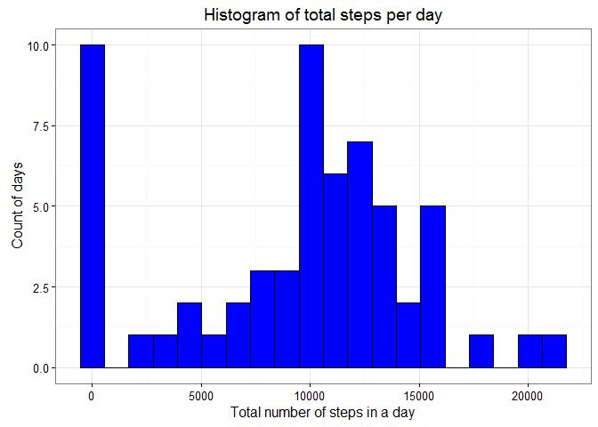
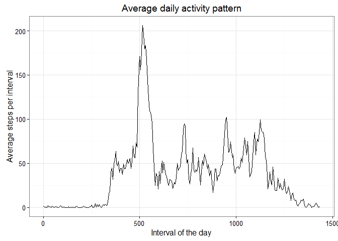
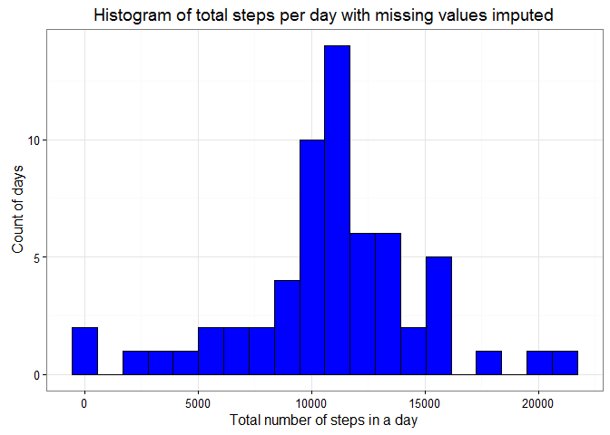
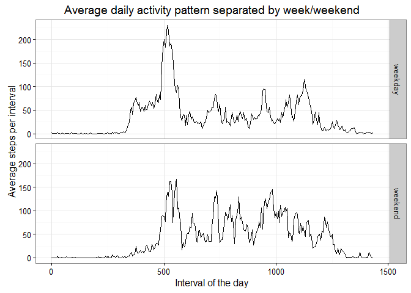

# Reproducible Research: Peer Assessment 1
###Author: rooiboschailatte
###Date: 26/06/2016

## Loading and preprocessing the data

The data being analysed was collected during October and November 2012. It records the number of steps taken during each of the 61 days in 5 minute intervals. In this analysis the "dplyr" package is used to process the data and the "ggplot2" package is used to plot the data. The warning and output messages from loading these packages are suppressed.

There are some missing values in the data, the date is coded as a factor and the interval values have jumps. The interval values start as 0, 5, 10, 15 ... but then skip from 55 to 100, 105, 110 etc. This pattern continues at the skip from 155 to 200, 255 to 300 and so on. In the code below the date is recoded as a date, the interval values are reassigned to run from 0 to 1435 (1440 minutes is 24 hours) in steps of 5 and the missing values are left to be dealth with later.


```r
## loading packages
library(dplyr)
library(ggplot2)

## preprocessing data, including standardising interval numbers
unzip("activity.zip")
activity <- read.csv("activity.csv")
activity$date <- as.Date(activity$date)
days <- length(unique(activity$date))
divisions <- length(unique(activity$interval))
time <- 5
activity$interval <- rep(time*c(0:(divisions-1)),days)
```


## What is mean total number of steps taken per day?

This section of code calculates the total number of steps recorded for each date and stores it in a data table called "dailysteps". The ggplot2 package is then used to plot a histogram of the frequency with which a particular day has that number of total steps.


```r
dailysteps <- summarise(group_by(activity,date),total_steps=sum(steps,na.rm=TRUE))
p1 <- ggplot(dailysteps,aes(total_steps)) +geom_histogram(bins=20,color="black",fill="blue") +theme_bw()
p1 +labs(title="Histogram of total steps per day",x="Total number of steps in a day",y="Count of days") 
```



The plot above shows that there are 10 days where no steps are recorded, this is probably largely due to the missing values in the dataset that are presently ignored. The next peak in the dataset occurs around 10'000 total steps a day.


```r
meansteps <- mean(dailysteps$total_steps)
medsteps <- median(dailysteps$total_steps)
```
The mean value for total steps per day, across all 61 days is 9354 and the median value is 10395. These values fall on either side of the observed peak around 10'000 total steps a day. The mean of 9'354 is skewed to lower value by the large number of days with 0 recorded steps.

## What is the average daily activity pattern?

This section of code calculates the average number of steps recorded for each time interval across all days and stores it in a data table called "dailypattern". The ggplot2 package is then used to plot a line graph of the mean steps for each interval of the day.


```r
dailypattern<-summarise(group_by(activity,interval),mean_steps=mean(steps,na.rm=TRUE))
p2 <- ggplot(dailypattern,aes(interval,mean_steps)) + geom_line() + theme_bw()
p2 +labs(title="Average daily activity pattern",x="Interval of the day",y="Average steps per interval")
```



This graph shows that on an average very few steps are taken before ~300 minutes into the day and that for the last couple of 100 minutes the number of steps fairly steadily decreases.


```r
time <-dailypattern$interval[dailypattern$mean_steps==max(dailypattern$mean_steps)]
```

The maximum number of steps in a 5 minute period happens, on average, between 515 and 520 minutes into the day. This is 8.6 hours after the recording has started. Perhaps this person goes for a run around that time most days.

## Imputing missing values

The code below calculates the number of missing values in the data using the "is.na()" funtion.


```r
missing <- sum(is.na(activity))
```

There are 2304 lines with missing values in the data. All of these missing values are in the "steps" variable.

To impute the missing values each missing value is replaced with the previously calculated mean value for the corresponding 5 minute interval of the day. This is done by looping through each line in the new data table "filledactivity" with the index i and, if the value for the steps variable is missing, calculating the index of the mean value for the corresponding 5 minute interval, j. This is calculated as the remainder of i/(number of 5 minute intervals).


```r
filledactivity <- activity
for (i in 1:length(filledactivity$steps)){
    if (is.na(filledactivity$steps[i])){
        j = i%%divisions
        if (j==0){j <- divisions}
        filledactivity$steps[i] <- dailypattern$mean_steps[j]
    }
}
```

Then a new histogram is plotted and the mean and median total number of steps calculated again.


```r
newdailysteps <- summarise(group_by(filledactivity,date),total_steps=sum(steps))
p3 <- ggplot(newdailysteps,aes(total_steps)) +geom_histogram(bins=20,color="black",fill="blue") +theme_bw()
p3+labs(title="Histogram of total steps per day with missing values imputed",x="Total number of steps in a day",y="Count of days") 
```



```r
meansteps2 <- mean(newdailysteps$total_steps)
medsteps2 <- median(newdailysteps$total_steps)
```

When missing data is imputed, the mean value for total steps per day, across all 61 days, is 1.0766189\times 10^{4} and the median value is 1.0766189\times 10^{4}. These are equal and both larger than the previous measurements of mean = 9354 and median = 10395.

The histogram with imputed values shows that now only 2 days have 0 recorded steps and the peak in the dataset occurs is both higher (14 days) and at higher total steps a day (~11'000). Imputing missing data with the mean for that time interval increases the estimates.

## Are there differences in activity patterns between weekdays and weekends?

This section of code transforms the date into a weekday and then creates a new factor variable "day" in the "filledactivity" data table, with labels "weekday" or "weekend".


```r
dayrec <- weekdays(filledactivity$date)
filledactivity$day <- factor((dayrec=="Saturday"|dayrec=="Sunday"),labels=c("weekday","weekend"))
```

This section of code calculates the mean number of steps for each time interval separately for weekdays and weekends and then plots two line graphs of the mean steps for each interval of the day.


```r
weekpattern<-summarise(group_by(filledactivity,interval,day),mean_steps=mean(steps))
p4 <- ggplot(weekpattern,aes(interval,mean_steps)) +geom_line() +facet_grid(day~.) +theme_bw()
p4 + labs(title="Average daily activity pattern separated by week/weekend", x="Interval of the day",y="Average steps per interval") 
```



The plot shows that steps start slower and later on weekend days but also tend to end later. Lastly, weekdays show a morning peak higher than 200 steps per 5 minutes and for the rest of the day peaks are mostly under 100 steps per 5 minutes but weekends do not show the very high peak in the morning but several peaks of 100-150 steps per 5 minutes during the day.

